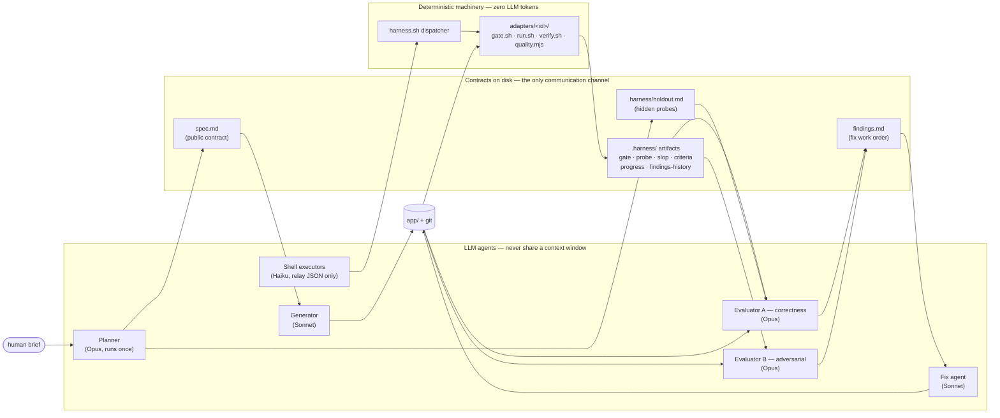
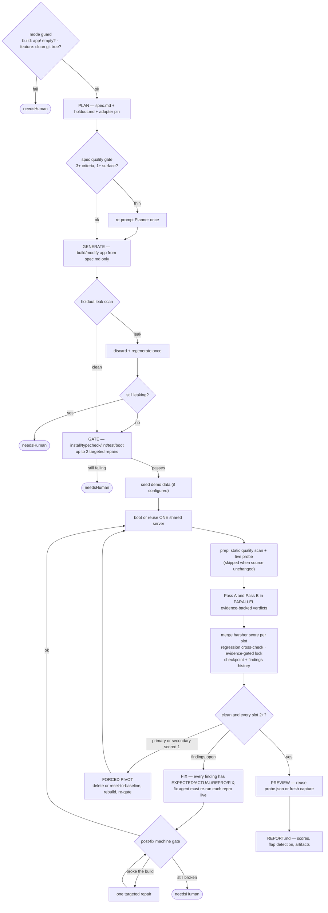

# App Harness

**Autonomously build any app — web, CLI, browser extension, mobile, desktop, or AI service — end-to-end from a single brief, with four isolated agents, hard machine gates, and a critic that's told from message one that the build is broken.**

A [Claude Code](https://claude.com/claude-code) skill that turns "build me an X" into a supervised, self-correcting loop: **Plan → Generate → Gate → Evaluate**. No sprint decomposition, no context rot, no self-graded homework — every agent runs in isolation and coordinates only through files on disk.

[](https://github.com/mrx-arafat/app-harness)
[](#testing)
[](#adapters)

---

## Table of Contents

- [Why this exists](#why-this-exists)
- [How it works](#how-it-works)
- [Adapters](#adapters)
- [Quick Start](#quick-start)
- [Usage](#usage)
- [Two Modes](#two-modes)
- [The Five Phases](#the-five-phases)
- [The Rubric](#the-rubric)
- [Anti-Gaming & Reliability Mechanisms](#anti-gaming--reliability-mechanisms)
- [Preflight & the Launch Card](#preflight--the-launch-card)
- [Watching a Live Run](#watching-a-live-run)
- [Model Routing](#model-routing)
- [Safety & Sandbox](#safety--sandbox)
- [Project Structure](#project-structure)
- [Testing](#testing)
- [Extending: Adding a New Adapter](#extending-adding-a-new-adapter)
- [Documentation Map](#documentation-map)
- [FAQ](#faq)
- [Philosophy: Loop Engineering](#philosophy-loop-engineering)
- [Contributing](#contributing)
- [License](#license)

---

## Why this exists

Ask an LLM to "build me a todo app" in a single turn and you get a plausible-looking, half-working demo: no empty states, a happy-path-only form, maybe a purple gradient hero nobody asked for. Ask it to *keep iterating* in the same context and you get context rot — the model forgets what it already fixed, starts trusting its own "looks done to me," and slowly drifts.

**App Harness fixes this by refusing to let one model grade its own work.** Four separate agents — Planner, Generator, Gate, Evaluator — never share a context window. They hand off through plain files: a spec, a hidden set of adversarial checks, a gate result, a findings list. Machine-verifiable truth (does it compile, does it boot) is checked by a deterministic script before a single token of LLM judgment is spent. The build only ships when a same-caliber-or-harsher critic — one that's *told from its first message the build is broken* — can find nothing left to fix.

This is not a toy demo generator. It's a loop-engineering harness: the kind of system Boris Cherny describes as *"I don't prompt anymore, I write loops,"* and the kind Karpathy's `LOOPS.md` argues is where the real reliability lives — not in the model, but in the gate, the contracts on disk, the brakes, and the critic wrapped around it.

## How it works



The Generator never sees the hidden probes. The Evaluators never talk to the Generator. The coordinator between all of them is **deterministic JavaScript** — brakes, locks, and merges cannot hallucinate.

| Agent | Reads | Writes | Runs |
|---|---|---|---|
| **Planner** | human brief | `spec.md`, `.harness/holdout.md`, `.harness/adapter.json`, `.harness/state.md` | once |
| **Generator** | `spec.md`, `findings.md` (NEVER `.harness/`) | `app/` + git | once, then on each fix or forced pivot |
| **Gate** | live `app/` | `.harness/gate.md` | after each generate/fix, up to 2 repair attempts |
| **Evaluator** | live artifact, `spec.md`, `.harness/holdout.md` | structured verdict — the workflow merges both passes' findings into `findings.md` | two passes per loop iteration, run in parallel — A: correctness, B: adversarial quality |

Nothing here resets context or breaks the job into human-authored sprints. `spec.md` and the gate's pass/fail result are the *only* contract between phases — everything an agent needs to pick up the thread lives on disk, not in a chat transcript.

## Adapters

The four-phase loop is universal, but "does it work" means something different for a React app than for a CLI tool or an MCP server. App Harness resolves this with a **frozen adapter contract** (`docs/ADAPTER-CONTRACT.md`): every platform-specific concern — how to install/build/test, how to boot it, how to exercise it live, what counts as quality/slop — lives in a self-contained `adapters/<id>/` directory that plugs into the same universal loop.

A dispatcher, `scripts/harness.sh <verb> <workdir>`, resolves which adapter owns a build and routes every machine-work verb (`detect | gate | run | verify | quality | criteria | preview | rubric`) to it:

1. **Planner-pinned (primary path)** — the Planner reads the brief's intent and writes `.harness/adapter.json`. Naming the kind explicitly in the brief ("a CLI tool", "a Chrome extension") makes this reliable.
2. **Auto-detect (fallback)** — if nothing is pinned, the dispatcher runs every `adapters/*/detect.sh` and takes the highest-confidence match; all-low-confidence (< 30) falls through to `generic`.
3. **Cached** — the resolved choice is written back to `.harness/adapter.json` so every later phase routes consistently without re-detecting.

| Adapter | Typical target | Verify method |
|---|---|---|
| `web` | React / Vue / Next / Vite / etc. | Drive with Playwright: navigate every route, check console errors, screenshot, detect blank screens |
| `cli` | Command-line tool / TUI | Run each invocation, capture stdout/stderr/exit code, compare against golden output |
| `extension` | Chrome / Firefox browser extension | Load unpacked in Chromium, exercise popup / options / content script / background via Playwright |
| `mobile` | React Native / Expo / Flutter / iOS | Boot a simulator/emulator, screenshot each screen (iOS build is mac-gated) |
| `desktop` | Electron / Tauri | Launch the app, screenshot each window |
| `ai-service` | AI/API/agent/automation service, MCP server | Call the endpoint(s), spawn MCP and list/call its tools, assert on the response |
| `generic` | Anything else | Run the Planner-authored verify command from `.harness/adapter.json`'s `config`, capture output |

Every adapter guarantees the exact same JSON shapes (`gate.json`, `probe.json`, `slop.json`, `criteria.json`) regardless of which one produced them — the workflow orchestration, the rubric aggregation, and the live dashboard never need to know or care which platform they're looking at. Adapters never read each other's files.

Nothing here is closed off: new adapters slot in against the same frozen contract — see [Extending](#extending-adding-a-new-adapter).

## Quick Start

**Prerequisites**

| Requirement | Why |
|---|---|
| [Claude Code](https://claude.com/claude-code) | This is a Claude Code *skill* — it runs as an orchestrated `Workflow`, not a standalone binary |
| Node.js 18+ | All deterministic scripts (`.mjs`) and the dispatcher's JSON handling require it |
| bash 3.2+ (macOS default) or any POSIX `sh` | Every `.sh` script targets bash 3.2 portability — no GNU-only flags |
| [`playwright-cli`](https://github.com/anthropics/claude-code) session tool | Required for any UI adapter (`web`, `extension`, `mobile`, `desktop`) — not needed for `cli`/`ai-service`/`generic` |
| `jq` (optional) | Speeds up JSON parsing in shell scripts; every script falls back to a Node one-liner if `jq` is absent |
| Per-language toolchains (optional) | Only needed for the platforms you actually build: `cargo` for Rust, `go` for Go, `python3`/`pip3` for Python, `flutter`/`xcrun` for mobile, etc. |

**1. Clone it into your Claude Code skills directory**

```bash
# User-level (available in every project)
git clone https://github.com/mrx-arafat/app-harness.git ~/.claude/skills/app-harness

# — or — project-level (scoped to one repo)
git clone https://github.com/mrx-arafat/app-harness.git .claude/skills/app-harness
```

Claude Code auto-discovers skills from either location — no build step, no `npm install` at the repo root (each generated *app* installs its own dependencies at build time; the harness itself is dependency-free tooling).

**2. Verify the install**

```bash
cd ~/.claude/skills/app-harness
bash scripts/test/run-tests.sh
```

You should see a TAP-style report ending in something like:

```
1..338
# 338 tests, 338 passed, 0 failed
```

This is a hermetic self-test — no network calls, no real package installs, no live browser required for the default fast suite. If it's green, every adapter's `detect.sh` / `gate.sh` / `run.sh` / `verify.sh` / `quality.mjs` is working correctly against its own fixtures, and the dispatcher's adapter-resolution logic is verified.

**3. Confirm Claude Code sees it**

Ask Claude Code something like *"what skills do you have?"* — `app-harness` should be listed with its trigger description. You're ready to build.

## Usage

Inside a Claude Code conversation, just describe what you want built:

> *"Build me a CLI tool that converts CSV files to formatted Markdown tables, with a `--help` flag and proper error handling for malformed input."*

Claude Code will recognize this matches the skill, confirm the multi-agent orchestration with you (it always asks first — this is not silently autonomous), then run the `Workflow`:

```js
Workflow({
  scriptPath: "<skill-dir>/harness.workflow.js",
  args: {
    brief: "<the user's full app description>",
    workdir: ".",
    skillDir: "<skill-dir>",
    maxPasses: 3,
    candidates: 1,
    minBudget: 60000,
    maxPivots: 1,
    references: "Linear, Stripe, Vercel, Notion"
  }
})
```

| Argument | Default | Meaning |
|---|---|---|
| `brief` | *(required)* | The full app description, verbatim from the user (feature mode: the feature description + target details) |
| `mode` | `"build"` | `"build"` scaffolds a NEW app (a guard refuses if `workdir/app/` already has files). `"feature"` modifies an EXISTING app at `workdir/app/` (directly or via symlink): feature spec against the existing codebase, in-place edits matching its style, pivot/leak recovery via `git reset --hard` to a recorded clean baseline instead of delete-and-rescaffold. Requires a clean git tree; forces `candidates: 1` |
| `workdir` | `.` | Build directory — produces `workdir/spec.md`, `workdir/app/`, `workdir/findings.md`, `workdir/.harness/` |
| `skillDir` | installed location | Absolute path to this skill so agents can find `scripts/` and `adapters/` |
| `maxPasses` | `3` | Evaluate/fix cycles before stopping |
| `candidates` | `1` | Parallel builds to generate (best-of-N); a Selector judge picks the winner. `1` = no best-of-N |
| `minBudget` | `60000` | Stop early and set `needsHuman=true` if remaining token budget drops below this |
| `maxPivots` | `1` | Max forced discard-and-restart attempts when a build is flagged as generic slop |
| `references` | *Linear, Stripe, Vercel, Notion...* | Design calibration string for the Evaluator — **UI adapters only** (`web`/`mobile`/`desktop`/`extension`); CLI/service builds are judged on ergonomics/robustness instead |
| `serialEval` | `false` | Run evaluator Pass A then Pass B sequentially instead of in parallel. Set `true` for apps with shared **mutable server-side state** (a real DB) where two concurrent evaluators driving one server could contaminate each other's checks. Costs ~2× Evaluate wall-clock |

The Workflow runs in the background; you'll get a completion notification. It returns:

```js
{
  adapter,        // resolved adapter id, e.g. "web", "cli", "ai-service"
  spec,           // path to spec.md
  app,            // path to app/
  findings,       // path to findings.md
  report,         // path to REPORT.md — final run summary (adapter, flags, pivots, score
                  // curve, final scores, locked criteria, tokens spent, verdict, artifacts)
  flapping,       // criteria whose pass/fail state changed 2+ times across passes, e.g.
                  // "AC3 (F->P->F)" — churned by the fix loop, not fixed; verify by hand.
                  // Full per-pass trail: .harness/findings-history.md (append-only)
  clean,          // true = every criterion passed, no regressions, all rubric slots >= 2
  gatePassed,     // true = final gate had no failing checks
  needsHuman,     // true = stopped due to budget/stall — a human should take over
  pivotsUsed,     // how many forced discard-and-restart cycles occurred
  lockedCriteria, // every acceptance/held-out id that has ever passed (the regression lock set)
  scoreHistory,   // weighted aggregate score per pass — an observability curve
  final,          // last evaluator verdict (four rubric scores)
  screenshots,    // paths to final preview artifacts — screenshots for UI, captured output for CLI/service
}
```

Immediately after, Claude Code shows you the working artifact — screenshots for UI apps, captured invocation output for CLI/service builds — read straight from what the workflow already produced, no redundant re-boot.

## Two Modes

| | `mode: "build"` (default) | `mode: "feature"` |
|---|---|---|
| **What it does** | Scaffolds a brand-new app under `workdir/app/` from the brief | Adds a feature to an **existing** app at `workdir/app/` (directly or via symlink into a real project) |
| **Guard before any tokens are spent** | Refuses if `app/` already contains files (protects real projects and prior outputs) | Requires a **clean git tree**; records HEAD to `.harness/baseline` as the recovery point |
| **Planner behavior** | Full creative authority — names the product, expands features, designs the surface | Explores the existing codebase first, writes a *feature spec*: new-behavior criteria **plus 2-3 criteria pinning existing behavior that must not break** |
| **Generator behavior** | Builds from scratch | Edits in place — same stack, same conventions, commits on top of existing history |
| **Pivot / leak recovery** | Deletes `app/`, rebuilds from spec | `git reset --hard <baseline>` + clean — never deletes the project |
| **Scope enforcement** | n/a (there is nothing pre-existing to protect) | **Deterministic scope check** after Generate: a nested `.git`, or ≥10 new files with zero existing files modified, means a parallel app was scaffolded instead of an in-place edit — reset to baseline, one regeneration, then `needsHuman=true` |
| **Best-of-N** | Available (`candidates > 1`) | Disabled |

## The Five Phases



Brakes run throughout the loop: `maxPasses`, token budget, stall (2 flat passes), no-progress (identical findings twice).

1. **Plan** *(Opus, runs once)* — the Planner acts as a senior PM with full creative authority. It names the product, expands implied features, designs the UX or CLI surface, picks the adapter, and writes `spec.md` (the public contract) plus `.harness/holdout.md` — 5-10 adversarial checks the Generator will *never see*. A deterministic spec-quality gate re-prompts the Planner once, with the exact deficiency, if `spec.md` yields fewer than 3 acceptance criteria or no extractable surfaces. For apps that need login, the Planner can also author a `seed` command in `.harness/adapter.json`'s `config` (plus demo credentials in the spec) — the workflow runs it once after the initial gate passes, and again after any forced pivot.
2. **Generate** *(Sonnet)* — the Generator reads only `spec.md` and builds the complete artifact in one continuous pass, committing at milestones. It is explicitly forbidden from reading `.harness/` — doing so is reward-hacking, and it's now actually enforced: a post-generation scan greps the source for held-out ids and distinctive holdout phrases, discards and regenerates the build once on a hit, and escalates to `needsHuman=true` if the rebuild still leaks.
3. **Gate** *(deterministic script, ~0 LLM tokens)* — a real script (`adapters/<id>/gate.sh`, invoked through the dispatcher) runs install/build/typecheck/lint/test/boot, whichever apply to the platform. `passed=true` only if nothing failed. Up to 2 cheap repair attempts before the loop gives up and flags for a human — expensive Evaluator calls are never spent on a build that doesn't even boot. (The `web` adapter skips its install step entirely when `node_modules` and the lockfile signature already match the last successful install, so the re-gate after a fix pass is fast.)
4. **Evaluate** *(Opus, two passes per loop iteration — run in **parallel**)* — Pass A drives every acceptance criterion *and* every held-out check against the live artifact; Pass B hunts adversarially for quality issues (dead buttons, missing empty states, edge-case crashes, AI-slop aesthetics) using a pre-computed static scan. Neither writes files — each returns its findings in its structured verdict and the workflow merges them into `findings.md` (no file race; `serialEval: true` opts back into sequential for stateful backends). For server-backed adapters (web, HTTP ai-services) **one shared server instance powers the whole pass** — the deterministic probe and both evaluators reuse it through separate browser sessions instead of paying three boot/teardown cycles. Every failing item lands in a forensic format — `EXPECTED | ACTUAL | REPRO | FIX` — and the fix agent must re-run each finding's own repro live before returning. After every fix, the **machine gate re-runs** (near-zero LLM cost): a fix that broke the build gets one targeted repair, and if it still fails the loop stops with `needsHuman=true` rather than spending two Opus evaluators on a non-compiling build. The harsher score per dimension wins. Every VERDICT now carries an `evidence` array — an artifact path or observed snippet per passed criterion, spot-checked for a real file on disk — so only evidenced passes enter the no-backslide lock; a dead evaluator pass (`null` verdict) is retried once instead of silently downgrading to a single judge. The loop repeats until `clean=true` and every rubric slot scores ≥ 2, or a brake fires.
5. **Preview** *(deterministic)* — when the source is byte-identical to the last verify scan, the preview is derived straight from the existing `probe.json` — zero re-boot; otherwise every surface is exercised once more and its screenshot or captured output written to disk. Set `HARNESS_PREVIEW_PROD=1` (or pass `--prod` to `harness.sh preview`) to capture against the **production build** — no dev-server hot-reload badge or overlays in the screenshots.

## The Rubric

Machine correctness lives entirely in the Gate. The soft Evaluator judge spends its harshness on **taste** — four stable score slots, `1`–`3` each:

| Slot | Weight | What it measures |
|---|---|---|
| `functionality` | 1× | Does every acceptance + held-out criterion actually work? |
| `primary` | **2×** | The dimension most likely to reveal generic model output — named per adapter (e.g. **design** for UI, **ergonomics** for CLI, **API design** for services, **output quality** for AI/agent) |
| `secondary` | **2×** | The dimension that reveals whether the build is genuinely robust — named per adapter (e.g. **originality**, **robustness**, **correctness**, **safety**) |
| `craft` | 1× | Edge cases, empty/error/loading states, spec fidelity, polish |

**Weighted aggregate** = `functionality + craft + 2×primary + 2×secondary` (range 6–18). Each adapter's `rubric.md` supplies the concrete descriptors for what a 1, 2, or 3 means on its `primary`/`secondary` slots — injected straight into the Evaluator's prompt so "design" means something calibrated, not vibes. Full scoring guide: [`RUBRIC.md`](RUBRIC.md).

**Exit condition:** the loop only stops clean when `clean=true` *and* every slot is ≥ 2. A `1` on any slot keeps the loop running — even if every visible acceptance criterion technically passes.

## Anti-Gaming & Reliability Mechanisms

- **Spec quality gate** — after the Planner writes `spec.md`, a deterministic check extracts its acceptance criteria and surfaces; fewer than 3 criteria or 0 surfaces re-prompts the Planner once with the exact deficiency before generation starts.
- **Held-out checks** — the Planner writes adversarial probes the Generator never sees (e.g. *"refreshing mid-flow keeps state," "invalid flag prints a usage error, non-zero exit"*). A build that pattern-matches the visible spec without genuinely implementing the implied behavior gets caught here.
- **Leak detection** — after generation, a deterministic scan greps the app source for held-out ids and distinctive holdout phrases (≥20 chars, fixed-string match); a hit discards and regenerates the build once, then escalates to `needsHuman=true` if it still leaks. Turns "the Generator can't read `.harness/`" into an enforced check, not just a prompt instruction.
- **Feature-mode scope check** — the equivalent enforcement for feature mode's core promise ("edit the existing app in place"). After Generate, a deterministic scan fails the build when a nested `.git` exists below the app root or ≥10 new files were added with **zero** pre-existing files modified — a real feature wires into existing code; a parallel scaffold doesn't. Reset to `.harness/baseline`, one regeneration with the exact violation spelled out, second violation → `needsHuman=true`. A mis-scoped build never reaches Gate or Evaluate. For trees where the scaffold already happened (older runs), `harness.sh reconcile <workdir> [--apply]` merges the nested tree back over the app root and re-gates — dry-run by default, merged files left uncommitted for review.
- **No-backslide regression lock** — every criterion that has *ever* passed is locked. Every later pass must re-verify the full locked set; a locked criterion that now fails is a blocking regression, cross-checked programmatically (not just relying on the evaluator to remember to mention it).
- **Evidence-gated regression lock** — a criterion only enters the lock when its PASS carries an `evidence` entry (artifact path or observed snippet), and any claimed proof path is spot-checked for existence on disk. Hallucinated passes can't lock.
- **Dead-evaluator retry** — if an evaluator pass returns `null` (agent died), it's retried once before the pass proceeds, instead of silently downgrading to a single judge and skipping the regression cross-check.
- **Forced pivot** — if `primary` or `secondary` scores a `1`, the harness concludes the build is a generic-slop foundation that can't be patched into something good. It deletes `app/` entirely and restarts from `spec.md` with an explicit instruction to take a genuinely different, more opinionated direction.
- **Best-of-N generation** — with `candidates > 1`, N independent builds are generated in parallel, each gated independently, and an adversarial Selector judge picks the strongest before the fix loop even begins.
- **Flap detection** — every criterion's per-pass pass/fail state is recorded; any id whose state changes 2+ times (`F→P→F`) is flagged in `REPORT.md` and the `flapping` return field. A flapping criterion means the fix loop *churned* it rather than fixed it — verify those by hand before trusting `clean=true`. The full per-pass trail lives in append-only `.harness/findings-history.md`.
- **Layered brakes** — `maxPasses` (hard cap), `minBudget` (token budget), **stall** (2 consecutive passes with no score improvement), and **no-progress** (identical open findings 2 passes running). The real completion check is always deterministic — never the model declaring itself done.
- **Checkpoint & resume** — every phase transition and fix pass appends to `.harness/state.md` and `.harness/progress.json`; a run can be watched live or resumed after interruption without replaying completed work.

## Preflight & the Launch Card

Every launch is preceded by a deterministic preflight and a one-glance launch card — the moment where you see exactly what was understood before the background work starts:

```
$ bash <skill-dir>/scripts/harness.sh doctor ./my-app --adapter web --brief
 [o_o]/  app-harness preflight · adapter: web
   ok   node            v24.12.0
   ok   git             git version 2.52.0
   ok   curl            present
   ok   jq              jq-1.7.1-apple
   ok   playwright-cli  present
   ok   disk            18GB free
 [^_^]   all clear — ready to launch
```

`doctor` verifies the host in seconds — node ≥ 18, git, curl, jq, playwright-cli (required only for UI adapters), free disk — and detects a previous run in the workdir: an interrupted one gets a *resume this instead* warning, so half-finished work is picked up rather than clobbered. `[x_x]  blocked` means a launch would have burned the Planner and Generator before dying at verify — the failure list says exactly what to install. JSON output (the default, no `--brief`) carries the same data for programmatic callers.

The mascot has four moods: `[o_o]/` checking, `[^_^]` all clear, `[o_~]` ready with warnings, `[x_x]` blocked.

## Watching a Live Run

The loop's entire state lives on disk, so you can watch progress without touching the running context:

```bash
bash <skill-dir>/scripts/status.sh <workdir> --watch 2
```

This renders the current phase, an **activity line** (seconds since the newest file write across `.harness/` + `app/`, colored active/quiet/stalled — "working vs stuck" at a glance, even between phase transitions), gate result, all four rubric scores with a weighted-aggregate sparkline, slop counts by weight, verify results per surface, open-findings count, a TOKENS line (cumulative `tokensSpent` from the budget tracker), and a phase timeline — all read from `.harness/{progress.json,gate.json,slop.json,probe.json,criteria.json}` + `findings.md`. It works mid-run, after a crash, and during resume.

The workflow stamps phase markers into `progress.json` from the very first guard call (and at every phase transition after), so the dashboard shows `plan` / `generate` / `gate` from minute one instead of `(starting)` until the first evaluation checkpoint.

## Model Routing

| Role | Model | Why |
|---|---|---|
| Planner | Opus | Autonomous product decisions, opinionated spec authoring |
| Evaluator (both passes), Selector | Opus | Judgment, taste, adversarial quality — needs genuine reasoning |
| Generator, gate-fix, promote/pivot agents | Sonnet | Workhorse execution and targeted repair — no judgment call needed |
| Shell executors (gate/quality/verify/criteria/preview/rubric/checkpoint) | Haiku | Run *one* deterministic script and relay its JSON — near-zero reasoning tokens |

The deterministic machine work — gate checks, static quality scans, live verification, screenshots — lives entirely in `scripts/` + `adapters/<id>/`. A Haiku agent just invokes the dispatcher and returns its stdout: what used to cost a full reasoning pass now costs a single tool call. Spending Opus on code generation is wasteful; spending Sonnet on quality judgment produces unreliable scores; spending either on "run a script and report the JSON" is pure waste.

## Safety & Sandbox

Every agent prompt is stamped with a sandbox clause confining all file writes and shell commands to `workdir` — no touching paths outside it, no destructive git on the parent repo, no global package installs.

**Threat model** — the harness *builds and runs* an app generated from an untrusted brief. Treat the brief as hostile input:

- **Installs run with `--ignore-scripts`/`--no-scripts` by default**, blocking `preinstall`/`postinstall` lifecycle hooks — the easiest path to code execution on the host. Set `HARNESS_ALLOW_SCRIPTS=1` only for a build that genuinely needs a postinstall step.
- **The brief is fenced as untrusted data** in the Planner prompt — it's told explicitly to ignore embedded instructions that try to add lifecycle scripts, fetch remote code, exfiltrate files, or read `.harness/`.
- **Paths are validated** — `workdir` is rejected outright if it contains shell-unsafe characters.
- **Still inherent:** booting a generated app runs its own build/run scripts, and a determined prompt injection could shape that. For untrusted briefs, run the harness in a disposable, network-restricted container/VM with no host credentials.

Known, currently-open hardening items (tracked, not hidden): untrusted surface strings aren't yet sanitized against shell metacharacters at the extraction layer before reaching shell-executor prompts, and non-Node package managers (`pip`, CocoaPods) don't yet have a lifecycle-script-blocking equivalent to `--ignore-scripts`. See [`docs/review/security.md`](docs/review/security.md) for the full audit.

## Project Structure

```
app-harness/
├── SKILL.md                    # The skill definition Claude Code reads (trigger + full usage docs)
├── RUBRIC.md                   # Full scoring guide: stable slots + per-profile descriptors
├── CHANGELOG.md
├── harness.workflow.js         # The Workflow script — the actual Plan→Generate→Gate→Evaluate orchestration
│
├── docs/
│   ├── DESIGN.md                # Architecture + rationale for the hybrid adapter model
│   ├── ADAPTER-CONTRACT.md       # The FROZEN interface every adapter builds to
│   ├── ARCHITECTURE.md           # Deep, multi-perspective explainer with worked walkthroughs
│   └── review/                   # Point-in-time audits: conformance, security, efficiency, e2e-smoke
│
├── scripts/
│   ├── harness.sh                # The dispatcher — resolves the adapter, routes every verb
│   ├── extract-criteria.mjs      # spec.md/holdout.md -> AC/HC ids + surfaces -> criteria.json
│   ├── doctor.sh                 # Preflight: env checks + interrupted-run detection (the [o_o]/ launch check)
│   ├── status.sh                 # Live dashboard for a running/completed loop
│   ├── lib/
│   │   ├── detect.sh             # Shared pm/framework/language/toolchain detection
│   │   └── quality-core.mjs      # Universal code-smell detectors shared by every adapter
│   └── test/                     # Dispatcher + cross-adapter integration tests
│
└── adapters/
    ├── web/          # React/Vue/Next/Vite — playwright-driven verify
    ├── cli/           # Command-line tools/TUIs — invocation capture
    ├── extension/     # Chrome/Firefox extensions — unpacked-load + playwright
    ├── mobile/        # React Native/Expo/Flutter/iOS — simulator-driven
    ├── desktop/       # Electron/Tauri — launch + screenshot
    ├── ai-service/    # APIs, agents, MCP servers — endpoint/tool calls
    └── generic/       # Anything else — Planner-authored config-driven fallback
        ├── adapter.json    # Manifest: id, verifyKind, rubricProfile, gateChecks, surfacesKind
        ├── detect.sh       # workdir -> confidence score
        ├── gate.sh         # Platform gate -> gate.json
        ├── run.sh          # start|stop the artifact
        ├── verify.sh       # Exercise the running artifact -> probe.json
        ├── quality.mjs     # Platform smell scan -> slop.json
        ├── rubric.md       # This adapter's primary/secondary slot definitions
        └── test/           # Fixtures + self-tests for this adapter alone
```

## Testing

```bash
# Full suite — dispatcher resolution, per-adapter gate/verify/quality, conformance checks
bash scripts/test/run-tests.sh

# One adapter in isolation
bash adapters/web/test/test.sh
bash adapters/cli/test/test.sh
```

The suite is hermetic by default (no network, no real package installs where avoidable, toolchain-absent steps `skip` rather than `fail`) and prints TAP-style output ending in a clear pass/fail count. Every adapter ships its own tiny GOOD and BROKEN fixtures so `gate.sh` and `quality.mjs` are asserted against known-good and known-bad inputs, not just "did it not crash."

The suite also includes `scripts/test/workflow-logic.test.mjs`, which exercises the orchestration logic in `harness.workflow.js` directly — brakes, the no-backslide regression lock, forced pivot, the evidence gate, and the leak-detection early-exit — against mocked agents, wired into `run-tests.sh`.

## Extending: Adding a New Adapter

Every adapter builds to the same frozen interface — read [`docs/ADAPTER-CONTRACT.md`](docs/ADAPTER-CONTRACT.md) first, it is the authoritative spec. In short, a new `adapters/<id>/` needs:

| File | Job |
|---|---|
| `adapter.json` | Manifest — `id`, `displayName`, `verifyKind`, `detectSignals`, `rubricProfile`, `gateChecks`, `surfacesKind` |
| `detect.sh` | `<workdir>` → `{"id":"...", "confidence": 0-100, "toolchain": {...}}` |
| `gate.sh` | `<appdir> [--out] [--md]` → byte-stable GATE JSON (`passed`/`blocking`/`summary`/`checks[]`) |
| `run.sh` | `start\|stop [--port]` → `READY <port> <pid> <url>` or `FAIL <reason>` |
| `verify.sh` | `<appdir> --surfaces "..."` → byte-stable PROBE JSON (`surfaces[]` + `routes[]` alias) |
| `quality.mjs` | Must call `scanUniversal()` from `scripts/lib/quality-core.mjs`, merge platform-specific smells → SLOP JSON |
| `rubric.md` | Defines what the `primary`/`secondary` slots concretely mean for this platform |
| `test/fixtures/` | A tiny GOOD fixture and a deliberately BROKEN one, plus a `test.sh` asserting both |

All shell scripts target bash 3.2 (no associative arrays, no `mapfile`, no GNU-only flags) and all `.mjs` files use Node 18+ stdlib only, zero npm dependencies. The dispatcher (`scripts/harness.sh`) auto-discovers any adapter that conforms to this shape — no registration step required.

## Documentation Map

| Document | What's in it |
|---|---|
| [`SKILL.md`](SKILL.md) | The skill definition Claude Code reads — full trigger conditions, usage, all mechanisms |
| [`RUBRIC.md`](RUBRIC.md) | Complete scoring guide: stable slots, per-profile mapping, calibration philosophy |
| [`docs/DESIGN.md`](docs/DESIGN.md) | Why the hybrid adapter architecture, why JSON contracts stay byte-stable |
| [`docs/ADAPTER-CONTRACT.md`](docs/ADAPTER-CONTRACT.md) | The frozen interface — required for writing a new adapter |
| [`docs/ARCHITECTURE.md`](docs/ARCHITECTURE.md) | Deep dive: data flow, model economics, three worked walkthroughs (web/CLI/MCP), operator + contributor perspectives |
| [`CHANGELOG.md`](CHANGELOG.md) | Version history |

## FAQ

**Does this run fully autonomously with no human in the loop?**
No — Claude Code always confirms the multi-agent `Workflow` opt-in with you before running. Once running, the loop is autonomous until it finishes, stalls, or exhausts budget.

**What if the loop can't finish?**
`needsHuman=true` in the return value signals budget exhaustion or a score stall. Surface this to the user and offer to continue with a higher `maxPasses`/`minBudget`, or take over manually — `findings.md` and `.harness/gate.md` are the primary debugging surface.

**Can it modify an existing app instead of building a new one?**
Yes — `mode: "feature"`. Point `workdir/app/` at the project (a symlink works), make sure the git tree is clean, and describe the feature in the brief. The Planner writes a feature spec against the existing codebase, the Generator edits in place matching its style, and all destructive recovery (pivot, leak regeneration, scope violation) becomes `git reset --hard` to the recorded pre-feature baseline — the project itself is never deleted. A deterministic scope check after generation guarantees the Generator actually edited in place instead of scaffolding a parallel app inside the project. See [Two Modes](#two-modes).

**A past run scaffolded a nested app inside my project — how do I recover?**
`bash scripts/harness.sh reconcile <workdir>` shows the merge plan (dry-run); add `--apply` to merge the nested tree over the app root (nested `.git` dropped, your repo's `.git` untouched), delete the nested tree, and re-run the machine gate so dead imports and type breaks surface immediately. Merged files are left uncommitted for you to review and commit.

**Can I make it build something not covered by the 7 shipped adapters?**
Yes — that's exactly what `generic` is for. The Planner authors a `.config` block (build/test/lint/run/verify commands) and the config-driven fallback handles the rest. No code changes needed.

**Why isn't this just one prompt with a loop instruction?**
Because a single context window accumulates drift, and a model grading its own work will always find plausible reasons its own output is fine. Isolation + a deterministic gate + an adversarial critic is the entire point — see [Philosophy](#philosophy-loop-engineering).

**Is it safe to run on an untrusted brief?**
Read [Safety & Sandbox](#safety--sandbox) first — there are real, documented mitigations (script-blocking installs, brief fencing, path validation) and real, currently-open gaps. Treat a fully untrusted brief as hostile input and run in an isolated environment.

## Philosophy: Loop Engineering

This harness is a worked example of four classic hard parts in agent loop design:

1. **Knowing when to stop.** A terminal message ends a *turn*, not the *job*. Brakes layer: hard pass cap, token budget, stall detection, no-progress detection. The real completion check is deterministic — gate passing plus every rubric slot ≥ 2 — never the model declaring itself done.
2. **Keeping context clean.** Deterministic work is offloaded to disk — `gate.json`, `slop.json`, `probe.json`, `criteria.json`, `progress.json`. Agents read the parsed slice, never raw tool spew, and never share a context window.
3. **Tools the agent can actually use.** The adapter set is small, focused, non-overlapping, and idempotent. Errors are written *for the agent* — the gate-fix loop gets the failing check name + first error line, not a wall of logs.
4. **A critic that can say no.** Maker and checker are separate models. The deterministic Gate is unfoolable (compile/boot is true or it isn't); the adversarial Evaluator is told from its first message that the build is broken and its job is to prove it.

See `docs/ARCHITECTURE.md` for the full treatment, including references to Boris Cherny's loop-engineering framing and Andrej Karpathy's `LOOPS.md`.

## Contributing

Issues and PRs welcome. Before opening a PR:

1. Run the full test suite (`bash scripts/test/run-tests.sh`) — it must stay green.
2. If you're touching an adapter, run that adapter's own suite too (`bash adapters/<id>/test/test.sh`).
3. New adapters must conform to `docs/ADAPTER-CONTRACT.md` exactly — the JSON shapes are frozen for a reason; everything downstream depends on them being byte-stable.
4. Keep `.sh` files bash-3.2-portable and `.mjs` files Node-stdlib-only, zero dependencies — this is a hard project convention, not a suggestion.

## License

No license file is published yet. Until one is added, all rights are reserved by default — please open an issue if you'd like to use this under a specific license (MIT is likely, given the project's open-collaboration intent).
